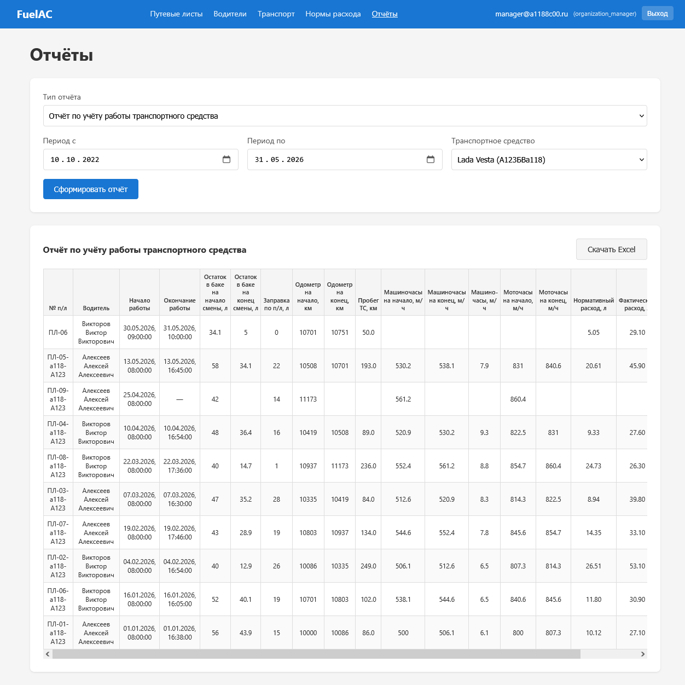
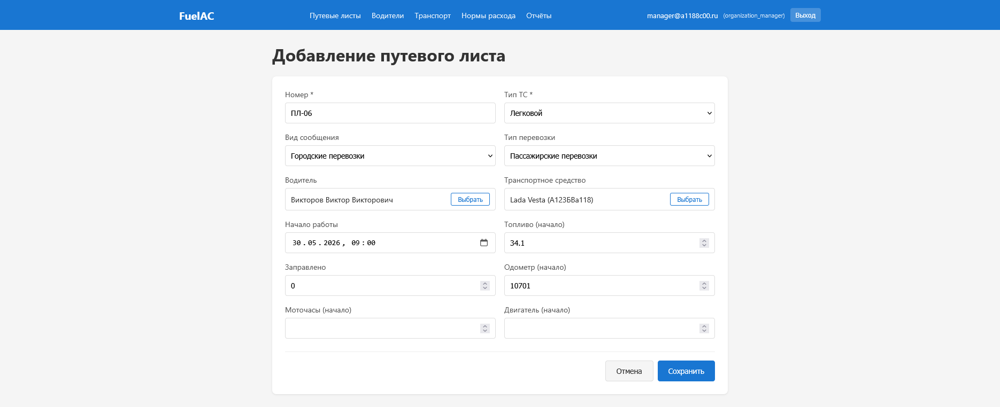
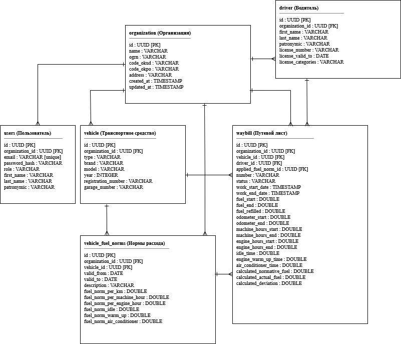

# FuelAC — учёт расхода топлива в автотранспортном предприятии

Веб-приложение для малых автотранспортных предприятий: ведение путевых листов,
автоматический расчёт нормативного и фактического расхода топлива и выгрузка отчётности
для бухгалтерского и налогового учёта. Выпускная квалификационная работа.

Задача, которую решает приложение: в небольших АТП расход топлива считают вручную
в таблицах. Это долго, легко ошибиться, а для налоговой нужен документально подтверждённый
расчёт по нормам Минтранса. Приложение закрывает весь цикл — от справочников техники
и норм до готового Excel-отчёта.

## Возможности

- Справочники: организации, пользователи, водители, транспортные средства.
- Нормы расхода топлива с периодом действия (`valid_from` / `valid_to`): при расчёте
  применяется норма, действовавшая на дату выполнения работы, история норм сохраняется.
- Путевые листы: создание, закрытие, жизненный цикл `OPEN` → `CLOSED`,
  запрет изменения и удаления закрытого документа.
- Расчёт нормативного и фактического расхода и отклонения между ними — с учётом пробега,
  моточасов, машиночасов, работы на холостом ходу, прогрева двигателя и кондиционера.
- Отчёты по работе транспортного средства с выгрузкой в Excel (Apache POI).
- Многоарендность: данные организаций изолированы, пользователь видит только свою организацию.
- Три роли: `ADMIN`, `ORGANIZATION_MANAGER`, `DISPATCHER`.
- Документация API — Swagger UI.

## Как выглядит

Формирование отчёта:



Создание путевого листа:



## Стек

**Сервер:** Java 21, Spring Boot 3.4, Spring Security + JWT (JJWT), Spring Data JPA / Hibernate,
PostgreSQL, Apache POI, SpringDoc OpenAPI, Maven.

**Клиент:** Vue 3 (Composition API), Vue Router, Pinia, Axios, Vite.

**Тесты:** JUnit 5, Mockito, MockMvc, H2 (in-memory).

## Структура

```
fuelac/       — серверная часть (Spring Boot, REST API)
fuelac-web/   — клиентская часть (Vue 3, SPA)
docker-compose.yml — БД + сервер + клиент
```

Сервер построен слоями: контроллеры → сервисы → репозитории, между слоями DTO.
Аутентификация без состояния на сервере: клиент получает JWT при входе и передаёт его
в заголовке `Authorization`. Пароли хранятся в виде BCrypt-хеша.

## Схема базы данных

Первичные ключи — UUID. Корень изоляции данных — организация: все подчинённые сущности
ссылаются на неё через `organization_id`.



## Запуск

```bash
docker compose up --build
```

- Клиент: http://localhost:5173
- API: http://localhost:8080
- Swagger UI: http://localhost:8080/swagger-ui.html
- PostgreSQL: порт 5433

Ключ подписи JWT и время жизни токена задаются свойствами `jwt.secret` и `jwt.expiration`
(в репозитории лежат значения для локальной разработки, в рабочей среде задаются
через переменные окружения).

## Тесты

```bash
cd fuelac && ./mvnw test
```

Модульные тесты сервисного слоя и компонента выдачи JWT, тесты контроллеров через MockMvc
с подменой сервисов, интеграционные — на H2.
